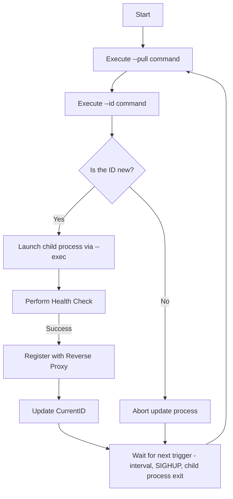

# liveroll

liveroll is a tool that enables live rolling updates of Docker containers in a systemd environment. It automatically performs tasks such as fetching new artifacts, checking versions (IDs), launching child processes, performing health checks, and registering with a reverse proxy—thus enabling zero-downtime updates. It also leverages the buffer functionality of oxy v2 to implement retry logic in the event of network errors.

---

## Features

- **Automatic Updates:**  
  Update processing is triggered periodically via the `--interval` flag, upon receiving a SIGHUP signal, or when a child process unexpectedly terminates.

- **Child Process Management:**  
  liveroll manages up to two child processes (specified by `--child-port1` and `--child-port2`) and launches new processes on an available port.  
  Old child processes are explicitly terminated and removed from the reverse proxy.

- **Reverse Proxy:**  
  Requests are load-balanced in a round-robin manner to healthy child processes using oxy v2 as the reverse proxy.  
  The integrated buffer functionality also allows retrying requests when temporary network errors occur.

- **Flexible Configuration:**  
  All commands (`--pull`, `--id`, `--exec`), update intervals, the health check path, and timeouts (via `--health-timeout`) can be specified on the command line.

---

## Installation

If you have a Go development environment set up, build liveroll with:

```sh
go build -o liveroll ./cmd/liveroll
```

---

## Usage

### Command Line Options

```sh
Usage of liveroll:
  --pull string
        Command to pull the new artifact.
  --id string
        Command that outputs the version or ID of the pulled artifact (printed to STDOUT).
  --exec string
        Command to launch the child process (supports template variables).
  --interval string
        Interval between update checks (default "10s"). Valid time units: "ns", "us", "ms", "s", "m", "h".
  --healthcheck string
        Path for the healthcheck endpoint (default "/heathz").
  --health-timeout duration
        Timeout for healthcheck (default 60s).
  --port int
        Port on which the reverse proxy listens (default 8080).
  --child-port1 int
        Port for child process 1 (default 9101).
  --child-port2 int
        Port for child process 2 (default 9102).
```

### Example

Here is a concrete example of launching liveroll:

```sh
liveroll --interval 10s --port 8080 --child-port1=9101 --child-port2=9102 \
    --pull="docker pull docker.io/tokuhirom/blog3:latest" \
    --id="docker inspect --format '{{.Image}}' docker.io/tokuhirom/blog3:latest" \
    --exec="docker run --rm -p 8080:<<PORT>> docker.io/tokuhirom/blog3:latest" \
    --health-timeout 30s
```

> **Note:**  
> The template variables `<<PORT>>` and `<<HEALTHCHECK>>` within the command are expanded to actual values before execution.

---

## How It Works

liveroll’s operation is divided into two major phases.

### 1. Initial Startup

1. **Pull:**  
   Execute the command specified by `--pull` to fetch the new artifact.

2. **Retrieve ID:**  
   Execute the command specified by `--id` to obtain the version or ID of the fetched artifact.

3. **Launch Child Process:**  
   Run the command specified by `--exec` (after substituting template variables) to start a child process.

4. **Health Check:**  
   Send a request to the child process’s healthcheck endpoint and confirm that an HTTP 200 response is received.  
   If successful, register that ID as the current ID.

### 2. Update Process

The update process is triggered under one of the following conditions:

- The time specified by `--interval` has elapsed.
- liveroll receives a **SIGHUP** signal (force update).
- A child process terminates unexpectedly.

#### Update Process Flow

1. **Pull and Retrieve ID:**  
   Execute the `--pull` and `--id` commands again.  
   *Note:* If this is not a forced update and the new ID matches the current ID, the process is aborted.

2. **Launch New Child Process:**  
   Select an available port (either child-port1 or child-port2) and launch a child process using the `--exec` command.

3. **Health Check and Registration:**  
   If the new child process passes the health check, register it as a backend with the oxy v2 reverse proxy and update the current ID.

4. **Terminate Old Processes:**  
   Any old child processes whose IDs do not match the new ID are terminated and removed from the reverse proxy.

---

### Signal Handling

- **SIGHUP:**  
  Upon receiving a SIGHUP, liveroll forces an update process.  
  *Note:* Even if the new ID is identical to the current ID, a new child process is launched.

- **SIGINT/SIGTERM:**  
  Upon receiving these signals, liveroll sends a termination signal to all child processes and then shuts itself down.

---

## System Architecture Diagram

The following Mermaid diagram illustrates the overall workflow of liveroll:



---

## Internal Details

### Template Functionality

The `--exec` command supports the following template variables:

- **`<<PORT>>`:**  
  The port number assigned to the child process. The child process must listen on this port.

- **`<<HEALTHCHECK>>`:**  
  The URL path for health checks, typically the value specified with `--healthcheck`.

### Port Management

- liveroll manages up to two child processes (using `--child-port1` and `--child-port2`).
- When launching a new process, an unused port is preferred.  
  If both ports are in use, an old process (whose ID does not match the current ID) is terminated to free up the port.

### HTTP Reverse Proxy

- A reverse proxy is implemented using oxy v2 in a round-robin fashion to distribute requests to healthy child processes.
- A buffer handler is combined with the proxy to perform retries in case of network errors.

### Health Check

- After launching a child process, liveroll periodically sends requests to the specified `--healthcheck` path.
- If an HTTP 200 response is not received within the period specified by `--health-timeout`, the child process is considered to have failed and is terminated.

---

## Notes

- **Port Reuse:**  
  Child processes must use `SO_REUSEADDR`. Failure to specify this may prevent the process from starting.

---

## License

    The MIT License (MIT)
    
    Copyright (C) 2025 Tokuhiro Matsuno
    https://64p.org/ <tokuhirom@gmail.com>
    
    Permission is hereby granted, free of charge, to any person obtaining a copy
    of this software and associated documentation files (the “Software”), to deal
    in the Software without restriction, including without limitation the rights
    to use, copy, modify, merge, publish, distribute, sublicense, and/or sell
    copies of the Software, and to permit persons to whom the Software is
    furnished to do so, subject to the following conditions:
    
    The above copyright notice and this permission notice shall be included in
    all copies or substantial portions of the Software.
    
    THE SOFTWARE IS PROVIDED “AS IS”, WITHOUT WARRANTY OF ANY KIND, EXPRESS OR
    IMPLIED, INCLUDING BUT NOT LIMITED TO THE WARRANTIES OF MERCHANTABILITY,
    FITNESS FOR A PARTICULAR PURPOSE AND NONINFRINGEMENT. IN NO EVENT SHALL THE
    AUTHORS OR COPYRIGHT HOLDERS BE LIABLE FOR ANY CLAIM, DAMAGES OR OTHER
    LIABILITY, WHETHER IN AN ACTION OF CONTRACT, TORT OR OTHERWISE, ARISING FROM,
    OUT OF OR IN CONNECTION WITH THE SOFTWARE OR THE USE OR OTHER DEALINGS IN
    THE SOFTWARE.
