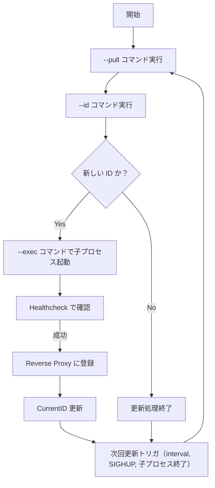

# liveroll

liveroll は、systemd 環境下で Docker コンテナのライブローリングアップデートを実現するツールです。  
新しいアーティファクトの取得、バージョン (ID) のチェック、子プロセスの起動、ヘルスチェック、逆プロキシへの登録などの処理を自動で行い、無停止アップデートを可能にします。  
また、oxy v2 の buffer 機能を利用して、ネットワークエラー時のリトライ処理も実現しています。

---

## 特徴

- **自動更新:**  
  定期実行（`--interval`）や SIGHUP シグナル受信、子プロセスの異常終了時に更新処理を実施します。

- **子プロセス管理:**  
  最大 2 つの子プロセス（`--child-port1` と `--child-port2`）を管理し、利用可能なポートに新規プロセスを起動します。  
  古い子プロセスは明示的に終了させ、リバースプロキシからも除外されます。

- **リバースプロキシ:**  
  oxy v2 を用いたラウンドロビン方式のリバースプロキシにより、正常な子プロセスへリクエストを振り分けます。  
  buffer 機能により、一時的なネットワークエラーにも対応可能です。

- **柔軟な設定:**  
  各種コマンド（`--pull`, `--id`, `--exec`）や更新間隔、ヘルスチェックのパス、タイムアウト（`--health-timeout`）などをコマンドライン引数で指定可能です。

---

## インストール

Go の環境が整っている場合、以下のようにビルドしてください。

```sh
go build -o liveroll ./cmd/liveroll
```

---

## 使い方

### コマンドラインオプション

```sh
Usage of liveroll:
  --pull string
        Command to pull the new artifact.
  --id string
        Command that outputs the version or ID of the pulled artifact (printed to STDOUT).
  --exec string
        Command to launch the child process (supports template variables).
  --interval string
        Interval between update checks (default "10s"). Valid time units: "ns", "us", "ms", "s", "m", "h".
  --healthcheck string
        Path for the healthcheck endpoint (default "/heathz").
  --health-timeout duration
        Timeout for healthcheck (default 60s).
  --port int
        Port on which the reverse proxy listens (default 8080).
  --child-port1 int
        Port for child process 1 (default 9101).
  --child-port2 int
        Port for child process 2 (default 9102).
```

### 起動例

以下は、具体的な起動例です。

```sh
liveroll --interval 10s --port 8080 --child-port1=9101 --child-port2=9102 \
    --pull="docker pull docker.io/tokuhirom/blog3:latest" \
    --id="docker inspect --format '{{.Image}}' docker.io/tokuhirom/blog3:latest" \
    --exec="docker run --rm -p 8080:<<PORT>> docker.io/tokuhirom/blog3:latest" \
    --health-timeout 30s
```

> **注意:**  
> コマンド内のテンプレート変数 `<<PORT>>` および `<<HEALTHCHECK>>` は、実行前に実際の値に展開されます。

---

## 動作の仕組み

liveroll の動作は大きく以下の 2 つのフェーズに分かれます。

### 1. 初回起動時

1. **Pull:**  
   `--pull` で指定されたコマンドを実行し、新しいアーティファクトを取得します。

2. **ID 取得:**  
   `--id` コマンドを実行して、取得したアーティファクトのバージョンまたは ID を得ます。

3. **子プロセス起動:**  
   `--exec` コマンド（テンプレート変数を展開）を実行し、子プロセスを起動します。

4. **ヘルスチェック:**  
   起動した子プロセスの healthcheck エンドポイントに対してリクエストを送り、HTTP 200 が返ってくることを確認します。  
   成功すれば、その ID を currentID として登録します。

### 2. 更新処理

更新処理は、以下のいずれかのタイミングで実施されます。

- `--interval` で指定された時間が経過した場合
- liveroll が **SIGHUP** を受信した場合（強制更新）
- 子プロセスが予期せず終了した場合

#### 更新処理のフロー

1. **Pull と ID 取得:**  
   再度 `--pull` と `--id` コマンドを実行します。  
   ※ 強制更新でない場合、新しい ID が現在の currentID と同一なら処理を中断します。

2. **新規子プロセスの起動:**  
   利用可能なポート（child-port1 または child-port2）を選択し、`--exec` コマンドにより子プロセスを起動します。

3. **ヘルスチェックと登録:**  
   子プロセスがヘルスチェックに成功した場合、oxy v2 のリバースプロキシのバックエンドとして登録し、currentID を更新します。

4. **古いプロセスの終了:**  
   新しい ID と一致しない古い子プロセスは終了させ、逆プロキシから除外します。

---

### 信号処理

- **SIGHUP:**  
  SIGHUP を受信すると、強制的に更新処理を実行します。  
  ※ この場合、ID が同一でも新たな子プロセスを起動します。

- **SIGINT/SIGTERM:**  
  これらのシグナルを受信すると、すべての子プロセスに終了シグナルを送信し、liveroll 自体も終了します。

---

## システム構成図

以下の Mermaid 図は、liveroll の全体的な動作フローを示しています。



---

## 内部処理の詳細

### テンプレート機能

`--exec` コマンド内でサポートされるテンプレート変数は以下の通りです。

- **`<<PORT>>`:**  
  子プロセスに割り当てられたポート番号。子プロセスはこのポートでリッスンする必要があります。

- **`<<HEALTHCHECK>>`:**  
  ヘルスチェック用の URL パス。通常は `--healthcheck` で指定した値が展開されます。

### ポート管理

- 最大 2 つの子プロセスを管理します（`--child-port1` と `--child-port2`）。
- 新規プロセス起動時、未使用のポートを優先して利用します。  
  両方のポートが使用中の場合、現在の currentID と一致しない古いプロセスを終了させ、新たに起動します。

### HTTP リバースプロキシ

- oxy v2 を利用したラウンドロビン方式の逆プロキシにより、正常な子プロセスへリクエストを振り分けます。
- buffer ハンドラを組み合わせ、ネットワークエラー時にリトライを行います。

### Healthcheck

- 子プロセス起動後、指定された `--healthcheck` パスに対して一定間隔でリクエストを送信します。
- `--health-timeout` で指定された期間内に HTTP 200 が返ってこなければ、起動失敗として子プロセスを終了します。

---

## 注意事項

- **ポート再利用:**  
  子プロセスは必ず `SO_REUSEADDR` を利用してください｡指定しないと起動できないことがあります｡

---

## ライセンス

    The MIT License (MIT)
    
    Copyright © 2025 Tokuhiro Matsuno, http://64p.org/ <tokuhirom@gmail.com>
    
    Permission is hereby granted, free of charge, to any person obtaining a copy
    of this software and associated documentation files (the “Software”), to deal
    in the Software without restriction, including without limitation the rights
    to use, copy, modify, merge, publish, distribute, sublicense, and/or sell
    copies of the Software, and to permit persons to whom the Software is
    furnished to do so, subject to the following conditions:
    
    The above copyright notice and this permission notice shall be included in
    all copies or substantial portions of the Software.
    
    THE SOFTWARE IS PROVIDED “AS IS”, WITHOUT WARRANTY OF ANY KIND, EXPRESS OR
    IMPLIED, INCLUDING BUT NOT LIMITED TO THE WARRANTIES OF MERCHANTABILITY,
    FITNESS FOR A PARTICULAR PURPOSE AND NONINFRINGEMENT. IN NO EVENT SHALL THE
    AUTHORS OR COPYRIGHT HOLDERS BE LIABLE FOR ANY CLAIM, DAMAGES OR OTHER
    LIABILITY, WHETHER IN AN ACTION OF CONTRACT, TORT OR OTHERWISE, ARISING FROM,
    OUT OF OR IN CONNECTION WITH THE SOFTWARE OR THE USE OR OTHER DEALINGS IN
    THE SOFTWARE.
